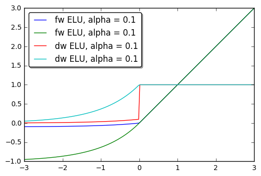

## ELU ##


**Scala:**

```scala
ELU(alpha: Double = 1.0, inplace: Boolean = false)
```
**Python:**
```python
ELU(alpha=1.0, inplace=False, bigdl_type="float")
```


Applies exponential linear unit (`ELU`), which parameter a varies the convergence value of the exponential function below zero:

`ELU` is defined as:

```
f(x) = max(0, x) + min(0, alpha * (exp(x) - 1))
```

The output dimension is always equal to input dimension.

For reference see [Fast and Accurate Deep Network Learning by Exponential Linear Units (ELUs)](http://arxiv.org/abs/1511.07289).


**Scala example:**
```scala
import com.intel.analytics.bigdl.utils._
import com.intel.analytics.bigdl.tensor.Tensor
import com.intel.analytics.bigdl.nn._
import com.intel.analytics.bigdl.tensor.TensorNumericMath.TensorNumeric.NumericFloat

val xs = Tensor(4).randn()
println(xs)
println(ELU(4).forward(xs))
```
```
1.0217569
-0.17189966
1.4164596
0.69361746
[com.intel.analytics.bigdl.tensor.DenseTensor of size 4]

1.0217569
-0.63174534
1.4164596
0.69361746
[com.intel.analytics.bigdl.tensor.DenseTensor of size 4]

```

**Python example:**

```python
import numpy as np
from bigdl.nn.layer import *

xs = np.linspace(-3, 3, num=200)
go = np.ones(200)

def f(a):
    return ELU(a).forward(xs)[0]
def df(a):
    m = ELU(a)
    m.forward(xs)
    return m.backward(xs, go)[0]

plt.plot(xs, f(0.1), '-', label='fw ELU, alpha = 0.1')
plt.plot(xs, f(1.0), '-', label='fw ELU, alpha = 0.1')
plt.plot(xs, df(0.1), '-', label='dw ELU, alpha = 0.1')
plt.plot(xs, df(1.0), '-', label='dw ELU, alpha = 0.1')

plt.legend(loc='best', shadow=True, fancybox=True)
plt.show()

```



