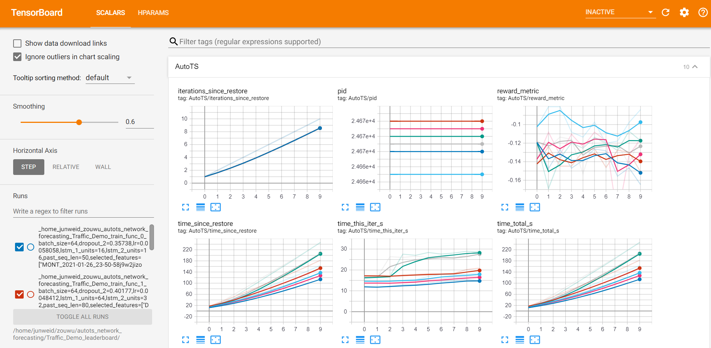
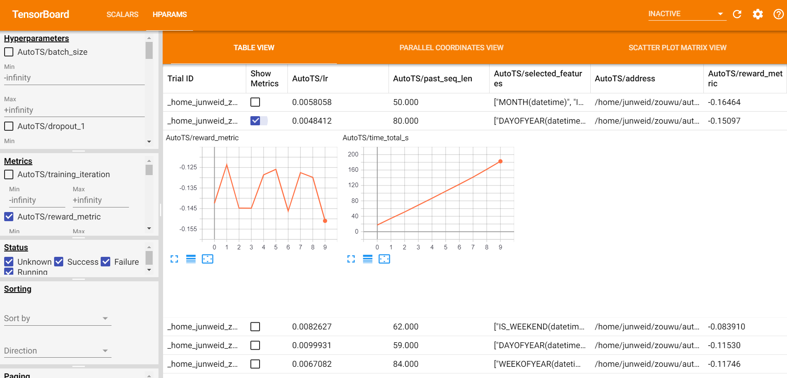

# Useful Functionalities Overview

#### **1. AutoML Visualization**

AutoML visualization provides two kinds of visualization. You may use them while fitting on auto models or AutoTS pipeline.
* During the searching process, the visualizations of each trail are shown and updated every 30 seconds. (Monitor view)
* After the searching process, a leaderboard of each trail's configs and metrics is shown. (Leaderboard view)

**Note**: AutoML visualization is based on tensorboard and tensorboardx. They should be installed properly before the training starts.

<span id="monitor_view">**Monitor view**</span>

Before training, start the tensorboard server through

```python
tensorboard --logdir=<logs_dir>/<name>
```

`logs_dir` is the log directory you set for your predictor(e.g. `AutoTSEstimator`, `AutoTCN`, etc.). `name ` is the name parameter you set for your predictor.

The data in SCALARS tag will be updated every 30 seconds for users to see the training progress.


After training, start the tensorboard server through

```python
tensorboard --logdir=<logs_dir>/<name>_leaderboard/
```

where `logs_dir` and `name` are the same as stated in [Monitor view](#monitor_view).

A dashboard of each trail's configs and metrics is shown in the SCALARS tag.



A leaderboard of each trail's configs and metrics is shown in the HPARAMS tag.



**Use visualization in Jupyter Notebook**

You can enable a tensorboard view in jupyter notebook by the following code.

```python
%load_ext tensorboard
# for scalar view
%tensorboard --logdir <logs_dir>/<name>/
# for leaderboard view
%tensorboard --logdir <logs_dir>/<name>_leaderboard/
```

#### **2. ONNX/ONNX Runtime support**
Users may export their trained(w/wo auto tuning) model to ONNX file and deploy it on other service. Chronos also provides an internal onnxruntime inference support for those **users who pursue low latency and higher throughput during inference on a single node**.

LSTM, TCN and Seq2seq has supported onnx in their forecasters, auto models and AutoTS. When users use these built-in models, they may call `predict_with_onnx`/`evaluate_with_onnx` for prediction or evaluation. They may also call `export_onnx_file` to export the onnx model file and `build_onnx` to change the onnxruntime's setting(not necessary).

```python
f = Forecaster(...)
f.fit(...)
f.predict_with_onnx(...)
```
#### **3. Distributed training**
LSTM, TCN and Seq2seq users can easily train their forecasters in a distributed fashion to **handle extra large dataset and utilize a cluster**. The functionality is powered by Project Orca.
```python
f = Forecaster(..., distributed=True)
f.fit(...)
f.predict(...)
f.to_local()  # collect the forecaster to single node
f.predict_with_onnx(...)  # onnxruntime only supports single node
```
#### **4. XShardsTSDataset**
```eval_rst
.. warning::
    `XShardsTSDataset` is still experimental.
```
`TSDataset` is a single thread lib with reasonable speed on large datasets(~10G). When you handle an extra large dataset or limited memory on a single node, `XShardsTSDataset` can be involved to handle the exact same functionality and usage as `TSDataset` in a distributed fashion.

```python
# a fully distributed forecaster pipeline
from orca.data.pandas import read_csv
from bigdl.chronos.data.experimental import XShardsTSDataset

shards = read_csv("hdfs://...")
tsdata, _, test_tsdata = XShardsTSDataset.from_xshards(...)
tsdata_xshards = tsdata.roll(...).to_xshards()
test_tsdata_xshards = test_tsdata.roll(...).to_xshards()

f = Forecaster(..., distributed=True)
f.fit(tsdata_xshards, ...)
f.predict(test_tsdata_xshards, ...)
```
