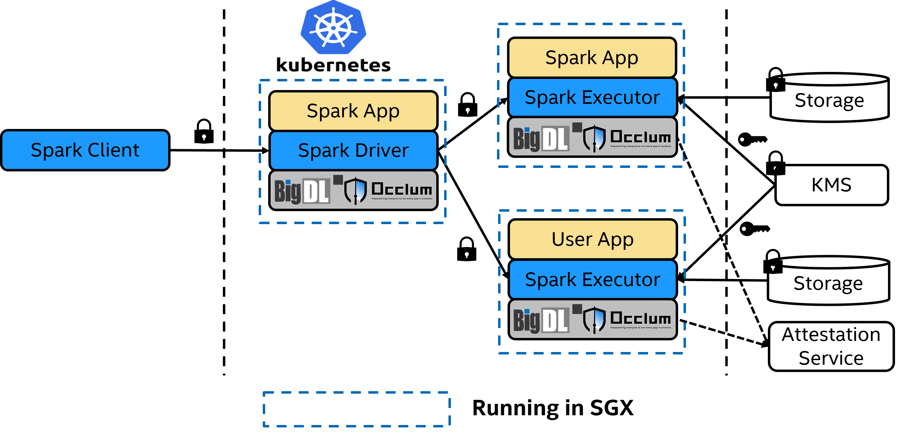

# BigDL PPML Occlum阿里云ECS中文开发文档

## 概要

本文档介绍了如何用BigDL PPML和Occlum实现基于SGX的端到端、分布式的隐私计算应用。BigDL PPML和Occlum为开发人员提供了一个简单易用的隐私计算环境。开发人员可以将现有应用无缝迁移到该运行环境中，实现端到端安全，并且可验证的分布式隐私计算。该类应用的计算性能接近明文计算，并且可以横向拓展以支持大规模数据集。

文档分为以下几部分：
1. 环境部署。介绍基于阿里云的PPML基本的环境部署和依赖安装。
2. 快速上手。介绍迁移或者开发新的隐私计算应用的基本流程。
3. 应用部署。介绍如何将PPML应用部署到生产环境中。
4. 背景知识。介绍SGX、Occlum和BigDL PPML的基本概念。

使用建议：
* 建议1234或者4123的顺序阅读本文档。
* 如果要将应用部署到生成环境中，请和管理员确认3和4中的内容是否符合内部的安全策略。





## 1. 环境部署

以下以阿里云环境为例，如果是基于裸金属机器搭建，请参考附录。
首先，我们需要一个安装了SGX Plugin的K8S集群环境。在本例中，我们在阿里云申请了两台g7t的ECS实例（ecs.g7t.4xlarge），基本配置如下。
| CPU核数  | 内存 | 安全内存（EPC）| 操作系统 |
| ------------- | ------------- | ------------- | ------------- |
| 32  | 64GB  | 32GB | Ubuntu 20.04 LTS 2 |

用户也可以根据自己的需求申请不同配置的ECS安全实例。
VM OS选择Ubuntu20.04 LTS2, 这也是Occlum标准release所基于的操作系统。
另外，系统内核需要升级以支持SGX。

```bash
sudo apt install --install-recommends linux-generic-hwe-20.04
```

然后，需要在每台实例上配置安装K8S环境，并配置安装K8S SGX plugin。
细节不再赘述，用户可以参考技术文档《在K8S上部署可扩展的基于Occlum的安全推理实例》或者附录的相关部分。

## 2. 快速上手

本章会介绍PPML基本概念，以及如何用BigDL PPML occlum image在SGX中执行应用程序。
需要注意的是：为了简化上手流程，我们会在运行环境中编译和运行SGX enclave；这种运行方式会有安全风险，仅能用于开发和测试，实际部署需要参照后面的生产环境部署章节。

### 2.1 基本概念

SGX应用需要编译(build)成SGX enclave，才能加载到SGX中运行。通常情况下，开发人员需要用SGX SDK重新编写应用，才能编译成合法的enclave，但这样的开发代价较大，维护成本也较高。为了避免上述问题，我们可以用Occlum实现应用的无缝迁移。Occlum是为SGX开发的LibOS应用，它可以将应用的系统调用翻译成SGX可以识别的调用，从而避免修改应用。BigDL PPML在Occlum的基础上，又进行了一次封装和优化，使得大数据应用，如Spark/Flink可以无缝的运行在SGX上。


作为硬件级的可信执行环境，SGX的攻击面非常小，攻击者即使攻破操作系统和BIOS也无法获取SGX中的应用和数据。但在端到端的应用中，用户还需要确保其他阶段的安全性。简而言之，用户需要确保数据或者文件在SGX外部是加密的，仅在SGX内部被解密和计算，如下图所示。为了实现这个目的，我们往往需要借助密钥管理服务 (Key Management Service, KMS) 的帮助。用户可以将密钥托管到KMS，等应用在SGX中启动后，再从KMS申请和下载密钥。


PPML项目的核心功能是帮助用户迁移现有的应用，用户可以选择迁移现有的大数据AI应用，也可以选择开发全新的应用。PPML应用的开发和常规应用基本相同。例如PySpark的应用代码和常规应用并没有区别。但在设计、编译和部署时有一定的差异。具体表现为：
* 设计时需要考虑加解密流程，确保明文数据只出现在SGX内部
* 编译时，需要通过Occlum将应用编译成SGX enclave
* 部署时，需要将SGX enclave部署到有SGX环境的节点

在剩下的章节中，我们以PySpark运行SQL和sklearn求线性回归方程为例，介绍如何
* 通过docker部署单机PySpark应用。
* 通过K8S部署分布式PySpark应用。

前者主要针对小数据量的单机环境，后者主要针对大数据量的分布式环境。

### 2.2 PySpark执行SQL任务

SparkSQL是Spark生态中的核心功能之一。通过Spark提供的SQL接口，数据分析师和开发人员可以通撰写简单的SQL语句实现对TB/PB级别数据的高效查询。在下面的例子中，我们将介绍如何通过Python格式的SQL文件，查询大规模数据。

#### 2.2.1 部署运行在docker容器中
1.	配置合适的资源，启动运行脚本`start-spark-local.sh`进入docker image中。

```bash
# Clean up old container
sudo docker rm -f bigdl-ppml-trusted-big-data-ml-scala-occlum
```

```bash
# Run new command in container
sudo docker run -it --rm \
--net=host \
--name=bigdl-ppml-trusted-big-data-ml-scala-occlum \
--cpuset-cpus 10-14 \
--device=/dev/sgx/enclave \  #需提前配置好的sgx环境
--device=/dev/sgx/provision \
-v /var/run/aesmd:/var/run/aesmd \
-v data:/opt/occlum_spark/data \
-e SGX_MEM_SIZE=24GB \   #EPC即使用的SGX内存大小
-e SGX_THREAD=1024 \
-e SGX_HEAP=1GB \
-e SGX_KERNEL_HEAP=1GB \
-e SGX_LOG_LEVEL=off \intelanalytics/bigdl-ppml-trusted-big-data-ml-scala-occlum:2.2.0-SNAPSHOT \
bash
```
2.	编写python源码，如sql_example.py 并将其放置在image的目录py-examples下
3.	修改/opt/run_spark_on_occlum_glibc.sh文件，设置程序启动入口。
```bash
run_pyspark_sql_example() {
    init_instance spark  #执行occlum init初始化occlum文件结构并设置对应配置
    build_spark #拷贝依赖并执行occlum build 构建可执行程序
    cd /opt/occlum_spark
    echo -e "${BLUE}occlum run pyspark SQL example${NC}"
    occlum run /usr/lib/jvm/java-8-openjdk-amd64/bin/java \
                -XX:-UseCompressedOops \
                -XX:ActiveProcessorCount=4 \
                -Divy.home="/tmp/.ivy" \
                -Dos.name="Linux" \
                -Djdk.lang.Process.launchMechanism=vfork \
                -cp "$SPARK_HOME/conf/:$SPARK_HOME/jars/*" \
                -Xmx3g org.apache.spark.deploy.SparkSubmit \ #选择合适的jvm大小
                /py-examples/sql_example.py  #新添加的文件位置
}

# switch case in the last
    pysql)
        run_pyspark_sql_example
        cd ../
        ;;
```

4.	运行PySpark SQL example在container里
```bash
bash  /opt/run_spark_on_occlum_glibc.sh pysql
```

注： 脚本里的build_spark是做”occlum build”来生成Occlum可执行的镜像，这一步骤会耗费不少时间（数分钟左右），请耐心等待。
非即时部署需提前配置源码和程序入口，并将步骤1的最后一行改为 bash /opt/run_spark_on_occlum_glibc.sh $1，即可直接通过运行bash start-spark-local.sh pysql 启动运行SQL example。

#### 2.2.2 将PySpark SQL任务部署运行在k8s集群中

##### 前提条件：
1.	阿里云实例上k8s集群已经配置好，k8s SGX device plugin已经安装好。
设置环境变量 "kubernetes_master_url"。
export kubernetes_master_url=${master_node_ip}

2.	阿里云实例上安装spark client工具（以3.1.2版本为例），用于提交spark任务。
```bash
wget https://downloads.apache.org/spark/spark-3.1.2/spark-3.1.2-bin-hadoop3.2.tgz
sudo mkdir /opt/spark
sudo tar -xf spark*.tgz -C /opt/spark --strip-component 1
sudo chmod -R 777 /opt/spark
export SPARK_HOME=/opt/spark"
```

3.	下载BigDL的代码，为后续的修改做准备。
```bash
git clone https://github.com/intel-analytics/BigDL.git
```

接下来的改动位于路径“BigDL/ppml/trusted-big-data-ml/scala/docker-occlum/kubernetes”。

##### 运行步骤：
1.	配置合适的资源在driver.yml和executor.yaml中

```yaml
#driver.yaml 同executor.yaml
    env:
    - name: DRIVER_MEMORY
      value: "1g"
    - name: SGX_MEM_SIZE   #EPC即使用的SGX内存大小
      value: "15GB"
    - name: SGX_THREAD
      value: "1024"
    - name: SGX_HEAP
      value: "1GB"
    - name: SGX_KERNEL_HEAP
      value: "1GB"
```
2.	运行脚本 run_pyspark_sql_example.sh，需提前配置好Spark和K8s环境。

```bash
${SPARK_HOME}/bin/spark-submit \
    --master k8s://https://${kubernetes_master_url}:6443 \
    --deploy-mode cluster \
    --name pyspark-sql \
    --conf spark.executor.instances=1 \
    --conf spark.rpc.netty.dispatcher.numThreads=32 \
    --conf spark.kubernetes.container.image=intelanalytics/bigdl-ppml-trusted-big-data-ml-scala-occlum:2.2.0-SNAPSHOT \
    --conf spark.kubernetes.authenticate.driver.serviceAccountName=spark \
    --conf spark.kubernetes.executor.deleteOnTermination=false \
    --conf spark.kubernetes.driver.podTemplateFile=./driver.yaml \ #资源配置
    --conf spark.kubernetes.executor.podTemplateFile=./executor.yaml \ #资源配置
    --conf spark.kubernetes.sgx.log.level=off \
    --executor-memory 1g \
    --conf spark.kubernetes.driverEnv.SGX_DRIVER_JVM_MEM_SIZE="1g" \
    --conf spark.executorEnv.SGX_EXECUTOR_JVM_MEM_SIZE="6g" \
    local:/py-examples/sql_example.py
    # hdfs://ServerIP:Port/path/sql_example.py
```
注:若用云存储或HDFS或者云存储传入源文件则无需提前在image里传入源文件。

### 2.3 PySpark运行sklearn LinearRegression

#### 2.3.1 部署运行在docker容器中
1.	配置合适的资源，启动运行脚本 start-spark-local.sh 进入docker image中。

```bash
# Clean up old container
sudo docker rm -f bigdl-ppml-trusted-big-data-ml-scala-occlum
```

```bash
# Run new command in container
sudo docker run -it --rm \
--net=host \
--name=bigdl-ppml-trusted-big-data-ml-scala-occlum \
--cpuset-cpus 10-14 \
--device=/dev/sgx/enclave \  #需提前配置好的sgx环境
--device=/dev/sgx/provision \
-v /var/run/aesmd:/var/run/aesmd \
-v data:/opt/occlum_spark/data \
-e SGX_MEM_SIZE=24GB \   #EPC即使用的SGX内存大小
-e SGX_THREAD=1024 \
-e SGX_HEAP=1GB \
-e SGX_KERNEL_HEAP=1GB \
-e SGX_LOG_LEVEL=off \intelanalytics/bigdl-ppml-trusted-big-data-ml-scala-occlum:2.2.0-SNAPSHOT \
bash
```

2.	编写python源码，如sklearn_example.py ， 并将其放置在image的目录py-examples下。

```python
# sklearn_example.py
import numpy as np
from sklearn.linear_model import LinearRegression
from sklearn.metrics import r2_score, mean_squared_error, mean_absolute_error, median_absolute_error
 
# Generate test data:
nSample = 100
x = np.linspace(0, 10, nSample)
e = np.random.normal(size=len(x))
y = 2.36 + 1.58 * x + e  # y = b0 + b1*x1
 
x = x.reshape(-1, 1)
y = y.reshape(-1, 1)
# print(x.shape,y.shape)
 
# OLS
modelRegL = LinearRegression()
modelRegL.fit(x, y)
yFit = modelRegL.predict(x)
 
print('intercept: w0={}'.format(modelRegL.intercept_))
print('coef: w1={}'.format(modelRegL.coef_))
 
print('R2_score ：{:.4f}'.format(modelRegL.score(x, y)))
print('mean_squared_error：{:.4f}'.format(mean_squared_error(y, yFit)))
print('mean_absolute_error：{:.4f}'.format(mean_absolute_error(y, yFit)))
print('median_absolute_error：{:.4f}'.format(median_absolute_error(y, yFit)))
```

3.	修改/opt/run_spark_on_occlum_glibc.sh文件，设置程序启动入口。
```bash
run_pyspark_sklearn_example() {
    init_instance spark  #执行occlum init初始化occlum文件结构并设置对应配置
    build_spark #拷贝依赖并执行occlum build 构建可执行程序
    cd /opt/occlum_spark
    echo -e "${BLUE}occlum run pyspark sklearn example${NC}"
    occlum run /usr/lib/jvm/java-8-openjdk-amd64/bin/java \
                -XX:-UseCompressedOops \
                -XX:ActiveProcessorCount=4 \
                -Divy.home="/tmp/.ivy" \
                -Dos.name="Linux" \
                -Djdk.lang.Process.launchMechanism=vfork \
                -cp "$SPARK_HOME/conf/:$SPARK_HOME/jars/*" \
                -Xmx3g org.apache.spark.deploy.SparkSubmit \ #选择合适的jvm大小
                /py-examples/sklearn_example.py  #新添加的文件位置
}

# switch case in the last
    pysql)
        run_pyspark_sklearn_example
        cd ../
        ;;
```

4.	运行PySpark sklearn example在container里
```bash
bash /opt/run_spark_on_occlum_glibc.sh pysklearn
```

注： 脚本里的build_spark是做”occlum build”来生成Occlum可执行的镜像，这一步骤会耗费不少时间（数分钟左右），请耐心等待。
非即时部署需提前配置源码和程序入口，并将步骤1的最后一行改为 bash /opt/run_spark_on_occlum_glibc.sh $1，即可直接通过运行bash start-spark-local.sh pysklearn 启动运行 sklearn example。

#### 2.3.2 部署运行在k8s集群中

**前提条件**参考前述章节的配置。
运行步骤：
1.	配置合适的资源在driver.yml和executor.yaml中
```yaml
#driver.yaml 同executor.yaml
    env:
    - name: DRIVER_MEMORY
      value: "1g"
    - name: SGX_MEM_SIZE   #EPC即使用的SGX内存大小
      value: "15GB"
    - name: SGX_THREAD
      value: "1024"
    - name: SGX_HEAP
      value: "1GB"
    - name: SGX_KERNEL_HEAP
      value: "1GB"
```
2.	运行脚本 run_pyspark_sklearn_example.sh,需配置Spark和K8s环境。
```bash
${SPARK_HOME}/bin/spark-submit \
    --master k8s://https://${kubernetes_master_url}:6443 \
    --deploy-mode cluster \
    --name pyspark-sql \
    --conf spark.executor.instances=1 \
    --conf spark.rpc.netty.dispatcher.numThreads=32 \
    --conf spark.kubernetes.container.image=intelanalytics/bigdl-ppml-trusted-big-data-ml-scala-occlum:2.2.0-SNAPSHOT \
    --conf spark.kubernetes.authenticate.driver.serviceAccountName=spark \
    --conf spark.kubernetes.executor.deleteOnTermination=false \
    --conf spark.kubernetes.driver.podTemplateFile=./driver.yaml \ #资源配置
    --conf spark.kubernetes.executor.podTemplateFile=./executor.yaml \ #资源配置
    --conf spark.kubernetes.sgx.log.level=off \
    --executor-memory 1g \
    --conf spark.kubernetes.driverEnv.SGX_DRIVER_JVM_MEM_SIZE="1g" \
    --conf spark.executorEnv.SGX_EXECUTOR_JVM_MEM_SIZE="6g" \
    local:/py-examples/sklearn_example.py
    # hdfs://ServerIP:Port/path/sklearn_example.py
```

注:若用云存储或者HDFS传入源文件则无需提前在image里传入源文件。

## 3. 生产环境部署

与快速上手阶段不同，生产部署需要考虑完整的数据流和密钥安全，并且需要根据现有的服务和设施进行对接。考虑到用户所用的服务有所差异，我们以开源和云服务为案例，介绍部署和配置KMS的基本过程；以及在安全环境中，构建生成环境中所需的image。
安装和配置KMS
KMS是SGX应用部署中的核心服务。用户可以直接使用阿里云提供的KMS，并配合云存储实现数据的透明加解密服务，详情请参照《对象存储客户端加密》。通过运行在SGX中的客户端加解密数据，可以保证明文数据只出现在SGX中。其他开源的分布式存储，例如HDFS也提供了类似的方案，请参考Hadoop官方文档配置HDFS透明加密，这里不再赘述。
为了提升安全水位，我们提供了带TEE 保护的开源KMS的部署方式供用户参考。即EHSM（运行在SGX中的KMS）。

### 3.1 安装和配置EHSM
安装EHSM的教程请参照文档《Deploy BigDL-eHSM-KMS on Kubernetes》。
使用PPMLContext和EHSM实现输入输出数据加解密
  用PPMLContext和EHSM实现SimpleQuery应用的数据加解密流程
1.	按照EHSM教程配置好PCCS和EHSM等环境。
注意因为是部署在阿里云上，阿里云有可用的PCCS服务，所以对于教程里的第一步“Deploy BigDL-PCCS on Kubernetes”可以忽略。
2.	注册获取app_id和api_key。
```bash
# Enroll
curl -v -k -G "https://<kms_ip>:9000/ehsm?Action=Enroll"
......

{"code":200,"message":"successful","result":{"apikey":"E8QKpBBapaknprx44FaaTY20rptg54Sg","appid":"8d5dd3b8-3996-40f5-9785-dcb8265981ba"}}
```
3.	填入相关参数，启动运行脚本 start-spark-local.sh 进入docker image。

其中，参数PCCS_URL可以根据阿里云安全增强型实例所在区域，设置为相对应的地址，细节请参考阿里云文档。
```bash
# Clean up old container
sudo docker rm -f bigdl-ppml-trusted-big-data-ml-scala-occlum
 ```

```bash
# Run new command in container
sudo docker run -it \
--net=host \
--name=bigdl-ppml-trusted-big-data-ml-scala-occlum \
--cpuset-cpus 10-14 \
--device=/dev/sgx/enclave \
--device=/dev/sgx/provision \
-v /var/run/aesmd:/var/run/aesmd \
-v data:/opt/occlum_spark/data \
-e SGX_MEM_SIZE=24GB \
-e SGX_THREAD=512 \
-e SGX_HEAP=512MB \
-e SGX_KERNEL_HEAP=1GB \
-e ATTESTATION=false \
-e PCCS_URL=$PCCS_URL \ #1
-e ATTESTATION_URL=ESHM_IP:EHSM_PORT \ #2
-e APP_ID=your_app_id \ #3
-e API_KEY=your_api_key \ #4
-e CHALLENGE=cHBtbAo= \
-e REPORT_DATA=ppml \
-e SGX_LOG_LEVEL=off \
-e RUNTIME_ENV=native \
intelanalytics/bigdl-ppml-trusted-big-data-ml-scala-occlum:2.2.0-SNAPSHOT \
bash
```

4. 生成加解密相关的密钥
```bash
bash /opt/ehsm_entry.sh generatekeys $APP_ID $API_KEY
```

5. 用提供的generate_people_csv.py 生成原始输入数据
```bash
python generate_people_csv.py /opt/occlum_spark/data/people.csv <num_lines>
```

6. 用密钥加密原始输入数据
```bash
bash /opt/ehsm_entry.sh  encrypt $APP_ID $API_KEY /opt/occlum_spark/data/people.csv
```

7. 修改加密的文件后缀并移动到合适的位置
```bash
mv /opt/occlum_spark/data/people.csv.encrypted /opt/occlum_spark/data/encrypt/people.csv.encrypted.cbc
```
8. 运行 BigDL SimpleQuery e2e Example（同上开发步骤，已提前写好程序入口，程序源码已打成jar包）
```bash
bash /opt/run_spark_on_occlum_glibc.sh sql_e2e
```
9. 解密计算结果
```bash
bash /opt/ehsm_entry.sh decrypt $APP_ID $API_KEY /opt/occlum_spark/data/model/{result_file_name}.
```

注：需要把SparkContext换成PPMLContext（源码需改动），才能支持密钥管理，和应用自动加解密服务。其大致流程为：
1.	应用通过PPMLContext读取加密文件
2.	PPMLContext自动从指定的密钥管理服务获取解密密钥
3.	应用解密数据并进行计算
4.	应用将计算结果加密后，写入到存储系统

### 3.2 构建部署生产应用image


在开发新应用时，SGX程序程序在启动前需要经历occlum init和occlum build两个阶段，才能构建可执行的occlum instance（opt/occlum_spark文件夹，所有依赖和程序都存储在当中）。但是，将build放到部署环境中，会导致build阶段用到的用户密钥（user key）暴露到非安全环境中。为了进一步提高安全性，在实际部署中需要将build阶段和实际运行分开，既在安全环境中build所需的image，然后在部署和运行该image。
在这个过程中，用户也可对BigDL image直接进行修改，加入自己的程序和配置（User image），并提前执行occlum init和build构建实际部署所需的image（Runnable image）。
```bash
# Production and Production-build and Customer image
#BigDL image or production image
docker pull  intelanalytics/bigdl-ppml-trusted-big-data-ml-scala-occlum-production:2.2.0

#Runable image or production-build image
docker pull  intelanalytics/bigdl-ppml-trusted-big-data-ml-scala-occlum-production:2.2.0-build

#Small size Runable image  or customer image
docker pull  intelanalytics/bigdl-ppml-trusted-big-data-ml-scala-occlum-production-customer:2.2.0-build
```

intelanalytics/bigdl-ppml-trusted-big-data-ml-scala-occlum-production: 2.2.0 image是提供给有定制docker image需求的客户的，下面以 pyspark sql example为例，说明如何定制化runnable image。
1.	获取production image
docker pull  intelanalytics/bigdl-ppml-trusted-big-data-ml-scala-occlum-production: 2.2.0

2.	运行启动脚本进入容器内部
```bash
# Clean up old container 
export container_name=bigdl-ppml-trusted-big-data-ml-scala-occlum-production 
sudo docker rm -f $container_name 
 
# Run new command in container 
sudo docker run -it \
        --net=host \
        --name=$container_name \
        --cpuset-cpus 3-5 \
        -e SGX_MEM_SIZE=30GB \
        -e SGX_THREAD=2048 \
        -e SGX_HEAP=1GB \
        -e SGX_KERNEL_HEAP=1GB \
        -e ENABLE_SGX_DEBUG=true \
        -e ATTESTATION=true \
        intelanalytics/bigdl-ppml-trusted-big-data-ml-scala-occlum-production:2.2.0 \
        bash
```

3.	添加相关python源码（/opt/py-examples/）或jar包依赖($BIGDL_HOME/jars/)或python依赖(/opt/python-occlum/)。如添加sql_example.py到/opt/py-examples/目录下。
4.	构建runnable occlum instance。这一步的作用是初始化occlum文件夹，并将源码和相关配置和依赖拷贝进/opt/occlum_spark中，并执行occlum build构建occlum runnable instance即production-build image。
```bash
bash /opt/run_spark_on_occlum_glibc.sh init
```

5.	退出后提交得到最终的runnable image。 intelanalytics/bigdl-ppml-trusted-big-data-ml-scala-occlum-production: 2.2.0-build 即不添加任何外部依赖的runnable image，可直接运行任意已有的example。
```bash
docker commit $container_name $container_name-build
```

得到的未定制的intelanalytics/bigdl-ppml-trusted-big-data-ml-scala-occlum-production: 2.2.0-build大小有14.2GB，其中仅有/opt/occlum_spark文件夹和少部分配置文件是运行时所需的，其余大多数是拷贝和编译产生的垃圾文件。可在 production-build image的基础上copy occlum runnable instance 并安装Occlum运行时依赖和其他一些依赖得到最终的customer image，其大小仅不到5GB，且其功能与production-build image基本相同， intelanalytics/bigdl-ppml-trusted-big-data-ml-scala-occlum-production-customer: 2.2.0-build 即不经过任何定制的customer image。（通过修改运行build-customer-image.sh文件构建customer image）

    Production-build 或 Customer image的attestation流程
1.	配置PCCS和EHSM环境，注册得到app_id和api_key，启动任务时，增加相关环境变量（同上）。
2.	验证ehsm是否可信
```bash
bash start-spark-local.sh verify
```
3.	离线注册occlum instance，得到 policy_Id
```bash
bash start-spark-local.sh register
# policy_Id 28da128a-c572-4f5f-993c-6da10d5243f8
```
4.	在docker环境或者k8s环境设置policy_Id。
```yaml
#start-spark-local.sh
-e ${policy_Id}

#driver.yaml and executor.yaml
env:
  - name: policy_Id
    value: "${policy_Id}"
          5.	在docker或k8s启动应用（同上），仅会在SGX中运行EHSM对应用程序进行验证（IV. attest MREnclave）。
```
## 4. 背景知识

### 4.1 Intel SGX

英特尔软件防护扩展（英语：Intel Software Guard Extensions，SGX）是一组安全相关的指令，它被内置于一些现代Intel 中央处理器（CPU）中。它们允许用户态及内核态代码定义将特定内存区域，设置为私有区域，此区域也被称作飞地（Enclaves）。其内容受到保护，不能被本身以外的任何进程存取，包括以更高权限级别运行的进程。

CPU对受SGX保护的内存进行加密处理。受保护区域的代码和数据的加解密操作在CPU内部动态（on the fly）完成。因此，处理器可以保护代码不被其他代码窥视或检查。SGX使用的威胁模型如下：Enclaves是可信的，但Enclaves之外的任何进程都不可信（包括操作系统本身和任何虚拟化管理程序），所有这些不可信的主体都被视为有存在恶意行为的风险。Enclaves之外代码的任何代码读取受保护区域，只能得到加密后的内容。[3]由于SGX不能防止针对运行时间等侧信道信息的测量和观察，在SGX内部运行的程序本身必须能抵抗侧信道攻击。

SGX被设计用于实现安全远程计算、安全网页浏览和数字版权管理（DRM）。其他应用也包括保护专有算法和加密密钥。

### 4.2 Occlum

2014年正式成立的蚂蚁集团服务于超10亿用户，是全球领先的金融科技企业之一。蚂蚁集团一直积极探索隐私保护机器学习领域，并发起了开源项目 Occlum。Occlum 是用于英特尔® SGX 的内存安全多进程用户态操作系统（LibOS）。
使用 Occlum 后，机器学习工作负载等只需修改极少量（甚至无需修改）源代码即可在英特尔® SGX 上运行，以高度透明的方式保护了用户数据的机密性和完整性。用于英特尔® SGX 的 Occlum 架构如图所示。

 
图 1.  Occlum架构

Occlum有以下显著特征:
* 高效的多任务处理。 Occlum提供轻量级LibOS流程:它们是轻量级的，因为所有LibOS流程共享同一个SGX enclave。 与重型、per-enclave的LibOS进程相比，Occlum的轻型LibOS进程在启动时最高快1000倍，在IPC上快3倍。 此外，如果需要，Occlum还提供了一个可选的多域软件故障隔离方案来隔离Occlum LibOS进程。
* 支持多个文件系统。 支持多种类型的文件系统，如只读散列文件系统(用于完整性保护)、可写加密文件系统(用于机密保护)、内存文件系统，不受信任的主机文件系统(用于LibOS和主机操作系统之间方便的数据交换)等等，满足应用的各种文件I/O需求。
* 内存安全。 Occlum是第一个用内存安全编程语言(Rust)编写的SGX LibOS。Rust语言是为追求内存安全，且不会带来额外的性能损耗的编程语言。因此，在Occlum中杜绝了低级的内存安全错误，对于托管安全关键的应用程序更值得信任。
* 支持musl-libc和glibc应用，支持超过150个常用系统调用，绝大多数程序无需改动（甚至无需重新编译）或者只需少许改动即可运行在Occlum LibOS之上。
* 支持多种语言开发的应用，包括但不限于c/c++，Java，Python，Go和Rust。
* 易用性。 Occlum提供了类容器的用户友好的构建和命令行工具。 在SGX enclave内的Occlum上运行应用程序可以非常简单。

### 4.3 BigDL PPML
在Occlum提供的安全内存运行环境上，英特尔和蚂蚁集团基于BigDL构建了一个分布式的隐私保护机器学习（Privacy Preserving Machine Learning, PPML）平台，能够保护端到端（包括数据输入、数据分析、机器学习、深度学习等各个阶段）的分布式人工智能应用。
 
图 2.  BigDL PPML 软件栈

与传统的隐私计算框架不同，BigDL PPML提供了一个可以运行标准大数据应用的环境，希望帮助现有的大数据/分布式应用无缝的迁移到端到端安全的环境中，并且强化每个环节的安全性。在此基础上，PPML也提供了安全参数聚集、隐私求交和联邦学习等高阶功能，帮助行业客户打破数据孤岛，进一步实现数据赋能。
以Apache Spark为例，通过BigDL PPML和Occlum提供的Spark in SGX功能，可以让现有的Spark应用，直接运行到SGX环境中，而不用做任何代码修改。受益于第三代至强平台提供的大容量SGX EPC，Spark的内存计算可以完全被SGX保护，并且可以根据数据规模进行横向拓展，从而轻松支持TB级别的数据规模；另一方面，负责完整性的远程证明功能，也被无感的添加到了整个流程中，应用开发者不需要显式的增加远程证明代码，即可通过Occlum和PPML提供的远程证明功能实现实例的远程证明和校验。
