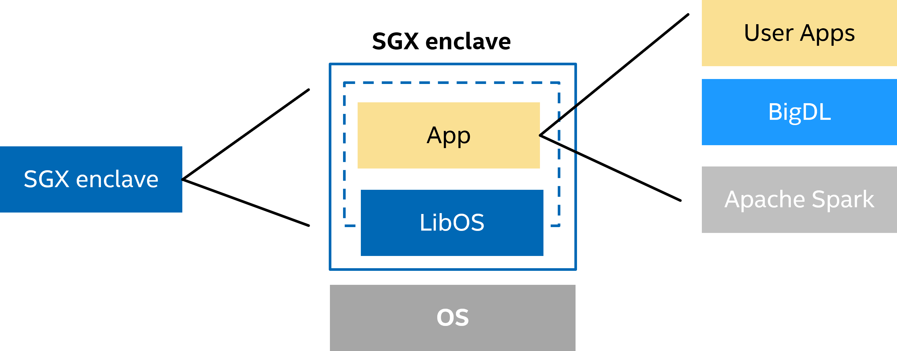

# Deploy PPML Applications in the Production Environment

PPML applications are a little different from normal machine learning applications, especially when these applications are buit on Intel SGX. Because, Intel SGX requires applications to be signed by a user-specified key, i.e., `enclave-key`. That requirement separates PPML deployment into 2 stages:
1. Test & Development
2. Build & Deployment
* Build & sign applications with enclave-key
* Deploy applications

## 0. Prerequisite

* BigDL PPML image, e.g., `intelanalytics/bigdl-ppml-trusted-big-data-ml-python-graphene` or `intelanalytics/bigdl-ppml-trusted-big-data-ml-scala-occlum`.
* Secured environment for signing applications & Build image. This environment has access to `enclave-key` and can build image based on BigDL PPML image.
* `enclave-key` for signing SGX applications.

## 1. Test & Development with PPML image

BigDL PPML provides necessary dependencies for building, signing, debuging and testing SGX applications. Due to security and privacy considerations, we use a random key or mounted key for signing SGX enclave.

## 2. Build & Deployment your applications

### Sign applications & Build your image

Note that: `enclave-key` is related to `mr_signer` and `mr_enclave`.

### Deploy applications

## References

1. [Intel SGX (Software Guard Extensions)](https://www.intel.com/content/www/us/en/developer/tools/software-guard-extensions/overview.html)
2. 