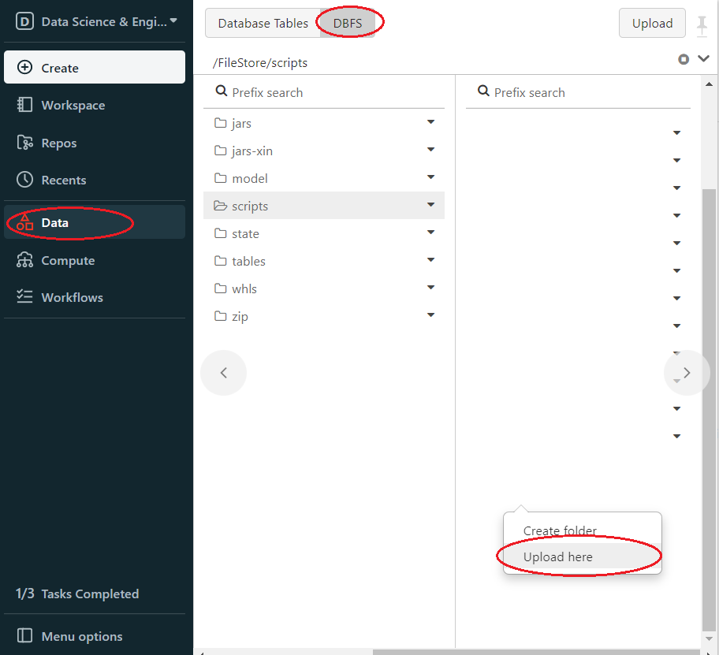
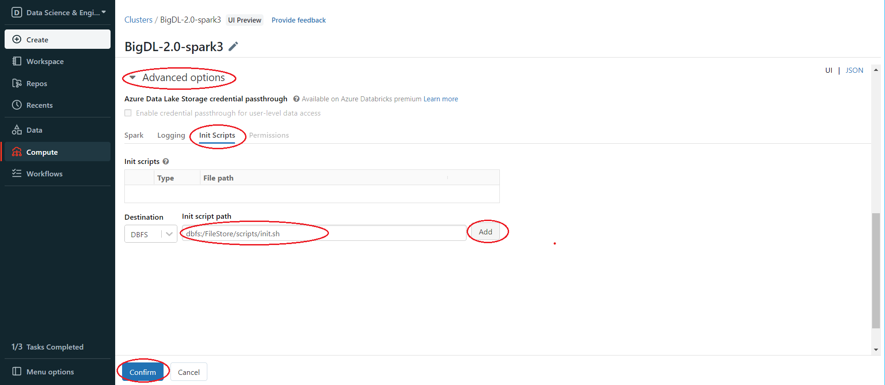
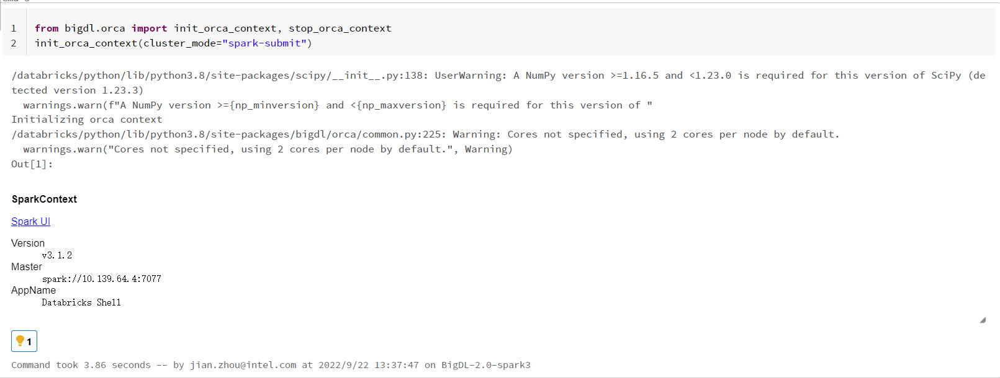
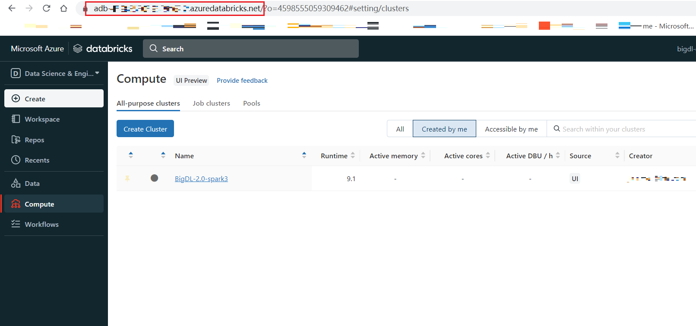
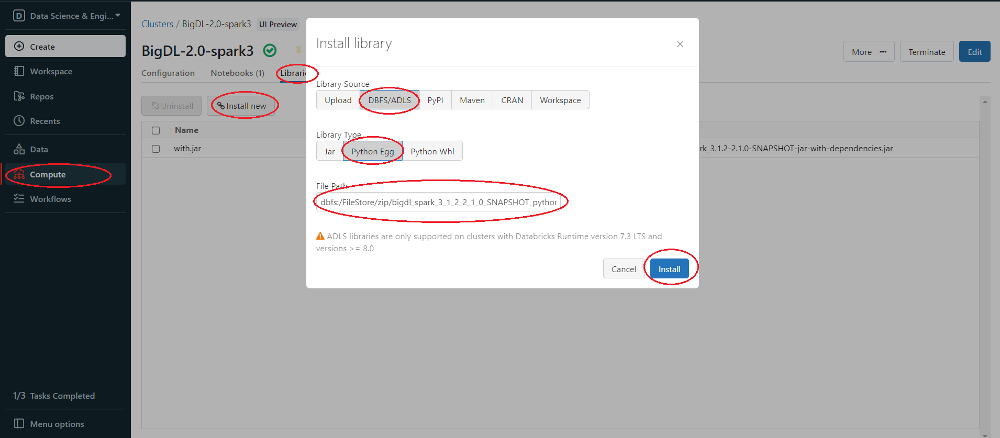

# Databricks User Guide

---

You can run BigDL program on the [Databricks](https://databricks.com/) cluster as follows.
### 1. Create a Databricks Cluster

- Create either an [AWS Databricks](https://docs.databricks.com/getting-started/try-databricks.html) workspace or an [Azure Databricks](https://docs.microsoft.com/en-us/azure/azure-databricks/) workspace. 
- Create a Databricks [cluster](https://docs.databricks.com/clusters/create.html) using the UI. Choose Databricks runtime version. This guide is tested on Runtime 9.1 LTS (includes Apache Spark 3.1.2, Scala 2.12).


### 2. Generate initialization script

[Init script](https://learn.microsoft.com/en-us/azure/databricks/clusters/init-scripts) is used to Install BigDL or other libraries. First, you need to put the **init script** into [DBFS](https://docs.databricks.com/dbfs/index.html), you can use one of the following ways.

Note that as Python 3.8 is highly recommended by BigDL, please set the Databricks runtime version to 9.1 LTS or 10.4 LTS to use the Python 3.8 environment.

**a. Generate init script in Databricks notebook**

Create a Databricks notebook and execute

```python
init_script = """
#!/bin/bash

# install bigdl-orca, add other bigdl modules if you need
/databricks/python/bin/pip install pip install --pre --upgrade bigdl-orca-spark3[ray]

# install other necessary libraries, here we install libraries needed in this tutorial
/databricks/python/bin/pip install tensorflow==2.9.1
/databricks/python/bin/pip install tqdm
/databricks/python/bin/pip install torch==1.11.0+cpu torchvision==0.12.0+cpu tensorboard -f https://download.pytorch.org/whl/torch_stable.html

# copy bigdl jars to databricks
cp /databricks/python/lib/python3.8/site-packages/bigdl/share/*/lib/*.jar /databricks/jars
"""

# Change the first parameter to your DBFS path
dbutils.fs.put("dbfs:/FileStore/scripts/init.sh", init_script, True)
```

To make sure the init script is in DBFS, in the left panel, click **Data > DBFS > check your script save path**.

> if you do not see DBFS in your panel, see [Appendix A](#appendix-a).

**b. Create init script in local and upload to DBFS**

Create a file **init.sh**(or any other filename) in your computer, the file content is

```bash
#!/bin/bash

# install bigdl-orca, add other bigdl modules if you need
/databricks/python/bin/pip install pip install --pre --upgrade bigdl-orca-spark3[ray]

# install other necessary libraries, here we install libraries needed in this tutorial
/databricks/python/bin/pip install tensorflow==2.9.1
/databricks/python/bin/pip install tqdm
/databricks/python/bin/pip install torch==1.11.0+cpu torchvision==0.12.0+cpu tensorboard -f https://download.pytorch.org/whl/torch_stable.html

# copy bigdl jars to databricks
cp /databricks/python/lib/python3.8/site-packages/bigdl/share/*/lib/*.jar /databricks/jars
```

Then upload **init.sh** to DBFS. In Databricks left panel, click **Data > DBFS > Choose or create upload directory > Right click > Upload here**.



Now the init script is in DBFS, right click the init.sh and choose **Copy path**, copy the **Spark API Format** path.


__Notes:__
* If Databricks returns an init script failure, please check your Databricks runtime and Python version.
* If your Databricks runtime version is 11.2 or later, click the `Edit` button and change the version to 9.1 LTS or 10.4 LTS.

### 3. Set Spark configuration

In the left panel, click **Compute > Choose your cluster > edit > Advanced options > Spark > Confirm**. You can provide custom [Spark configuration properties](https://spark.apache.org/docs/latest/configuration.html) in a cluster configuration. Please set it according to your cluster resource and program needs.


See below for an example of Spark config setting **needed** by BigDL. Here it sets 2 core per executor. Note that "spark.cores.max" needs to be properly set below.

```
spark.executor.cores 2
spark.cores.max 4
```

### 4. Install BigDL Libraries

Use the init script from [step 2](#2-generate-initialization-script) to install BigDL libraries. In the left panel, click **Compute > Choose your cluster > edit > Advanced options > Init Scripts > Paste init script path > Add > Confirm**.



Then start or restart the cluster. After starting/restarting the cluster, the libraries specified in the init script are all installed.

### 5. Run BigDL on Databricks

Open a new notebook, and call `init_orca_context` at the beginning of your code (with `cluster_mode` set to "spark-submit").

```python
from bigdl.orca import init_orca_context, stop_orca_context
init_orca_context(cluster_mode="spark-submit")
```

Output on Databricks:



**Run Examples**

- [Keras example on Databricks](https://github.com/intel-analytics/BigDL/blob/main/python/orca/tutorial/databricks/tf_keras_ncf.ipynb)
- [Pytorch example on Databricks](https://github.com/intel-analytics/BigDL/blob/main/python/orca/tutorial/databricks/pytorch_fashion_mnist.ipynb)
> Note
> * If you run Pytorch example with `spark` backend (i.e.`Estimator.from_torch(..., backend="spark")`) on multiple node cluster, you need to set GLOO_SOCKET_IFNAME="eth0" in cluster's configuration as below:

> * If you want to save model to DBFS, or load model from DBFS, the save/load path should be the **File API Format** on Databricks, which means your save/load path should start with `/dbfs`.

### 6. Other ways to install third-party libraries on Databricks if necessary

If you want to use other ways to install third-party libraries, check related Databricks documentation of [libraries for AWS Databricks](https://docs.databricks.com/libraries/index.html) and [libraries for Azure Databricks](https://docs.microsoft.com/en-us/azure/databricks/libraries/).

### Appendix A

If there is no DBFS in your panel,  go to **User profile > Admin Console > Workspace settings > Advanced > Enabled DBFS File Browser**


### Appendix B

Use **Databricks CLI** to upload file to DBFS. When you upload a large file to DBFS, using Databricks CLI could be faster than using the Databricks web UI.

**Install and config Azure Databricks CLI**

1. Install Python, need Python version 2.7.9 and above if you’re using Python 2 or Python 3.6 and above if you’re using Python 3.

2. Run `pip install databricks-cli`

3. Set authentication, Click **user profile icon > User Settings > Access tokens > Generate new token > generate > copy the token**, make sure to **copy** the token and store it in a secure location, **it won't show again**.

   

4. Copy the URL of Databricks host, the format is `https://adb-<workspace-id>.<random-number>.azuredatabricks.net`, you can copy it from your Databricks web page URL.

   

5. In cmd run `dbfs config --token` as shown below:

   ```
   dbfs configure --token
   Databricks Host (should begin with https://): https://your.url.from.step.4
   Token: your-token-from-step-3
   ```

6. Verify whether you are able to connect to DBFS, run "databricks fs ls".

   

**Upload through Databricks CLI**

Now, we can use Databricks CLI to upload file to DBFS. run command:

```
dbfs cp /your/local/filepath/bigdl-assembly-spark_3.1.2-2.1.0-SNAPSHOT-jar-with-dependencies.jar dbfs:/FileStore/jars/stable/bigdl-assembly-spark_3.1.2-2.1.0-SNAPSHOT-jar-with-dependencies.jar
```

After command finished, check DBFS in Databricks, in left panel, click **Data > DBFS > your upload directory**, if you do not see DBFS in your panel, see [Appendix A](#appendix-a).

**Install package from DBFS**

In the left panel, click **Compute > choose your cluster > Libraries > Install new > Library Source(DBFS/ADLS) > Library Type(your package type)**.

